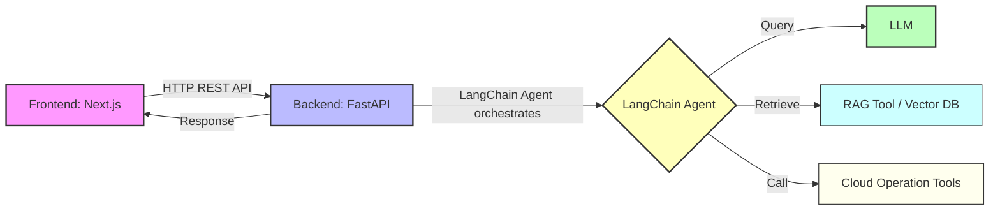

# Cloud Operation via AI Chat
A lightweight prototype AI Cloud Assistant Tool, enabling natural language-based cloud operations.

## Features
- Execute common cloud operations via natural language
- Control VM instances, Storage buckets, and Monitoring metrics of VMs
- Supports multiple LLMs (Gemini, OpenAI, watsonx) for natural language understanding

## Architecture
- Frontend (Next.js) communicates via REST API with backend (FastAPI)
- Backend uses LangChain to connect Gemini LLM with cloud operation tools
- Tools for Cloud services are defined with `@tool` and registered to the agent

### Architecture Diagram



### Details
- **Frontend**: Next.js submits user's request.
- **Backend**: FastAPI + LangChain Agent processes the request.
- **LLM**: LLM understands request's context.
- **Cloud Operation Tools**: Tools operate cloud environments.
- **Cloud Services(GCP, AWS, Azure, IBM Cloud)**: Cloud resources(VM and Storage).


## Stack
- Frontend: Next.js
- Backend: Python, FastAPI, LangChain
- Vector DB (optional for context memory): Chroma or FAISS

## Prerequisites
- Python 3.11+
- Node.js 20+
- Cloud Service Environment (for VM/Storage/Monitoring operations)
- LLM Credential(Gemini, OpenAI or watsonx)

## Environment Variables
Create a `.env` file in `backend/` and `.env.local` file in `frontend/`.

## Getting started
### Backend
```sh
cd backend
python -m venv venv
source venv/bin/activate
pip install -r requirements.txt
uvicorn main:app --reload
```

### Frontend
```sh
npm install
npm run build
npm run start
```

## Usage

## Chat Interface
Submit a text via frontend:  
e.g., 
```txt
 Create a new bucket named "new-bucket" in the test environment.
```


## Rest API
Send a POST request to the backend API /chat with JSON payload:
```json
{
  "message": "List all VM instances"
}
```

The agent will reply with results from LLM and/or tools.

## Notes
Ensure that the LLM and your Cloud Service credentials are correctly set before starting the backend.  
Use structured tools (@tool) for safer argument passing to LangChain agents.

## Future Work
- Add function to show cloud configuration overview (VMs, storage, network)
- Review and improve docstrings of tools for LangChain agent
- Add for more various types of Cloud Operation
- Ensure to store credentials safely (consider using Vault)
- Improve vector retrieval accuracy with embedding fine-tuning, or use more efficient methods
- Add multi-document context aggregation
